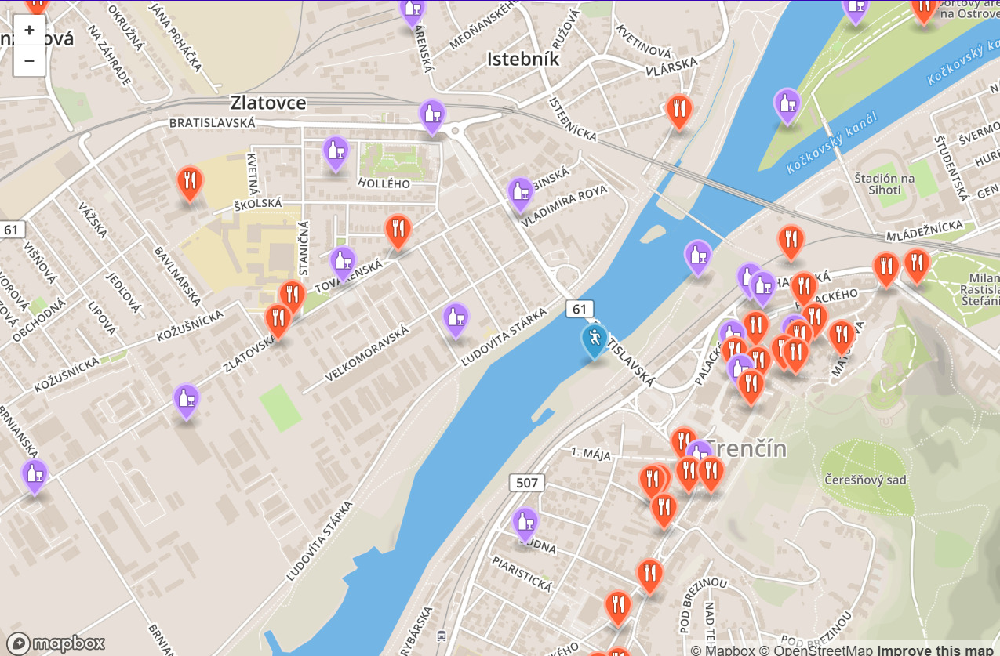

JANKA FABUŠOVÁ

# Úvod
Webová aplikácia zobrazuje reštaurácie a bary v Trenčíne a jeho širšom okolí.
Používateľovi sú umožnené nasledujúce scenáre:
  - vykreslenie barov a reštaurácií na mape 
  - zobrazenie reštaurácii v oblasti 10 km
  - zobrazenie barov v oblasti 10 km
  - zobrazenie 1O najbližsích barov/reštaurácií vzhľadom na jeho polohu
  - vykreslenie parkovísk v jeho okolí
  - filtrovanie barov/reštaurácií podľa názvu
  - zobrazenie detailu na klik

Takto to vyzerá v akcii:



Webová aplikácia je zložená z dvoch častí. [Frontend](#frontend), ktorý využíva html, css, mapbox API, mapbox.js a [backend](#backend), ktorý je napísaný v Python-e s použitím frameworku [CherryPy](#http://cherrypy.org) a ďalej komunikuje s PostGIS-om. Frontend a backend komunikujú pomocou RestAPI.

# Frontend

Frontend je staticka HTML stránka, ktorej kód sa nachádza v (`index.html`). Stránka obsahuje mapu a bočný panel. Mapa komunikuje zo serverom prostredníctvom [mapbox.js](https://api.mapbox.com/mapbox.js/v3.1.1/mapbox.js). Všetok potrebný kód sa nachádza v `public/app.js`. Vykonáva sa v ňom komunikácia s backendom, a spracovanie prijatých dát, ktoré prijíma z backendu vo forme JSONu resp geoJSONu. Prijaté dáta zobrazí do mapy a bočného panelu. Tento `geoJSON` sa trocha upravuje, pretože v ňom nie sú informácie o markeroch a tiež poloha používateľa.

# Backend

Backend je napísaný v Pythone pomocou frameworku [CherryPy](#http://cherrypy.org). K databáze sa pripája pomocou `Python` knižnice [psycopg2](http://initd.org/psycopg/). Backend počúva na jednotlivé requesty z [frontendu](#frontend), tieto requesty potom vyhodnocuje a po vykonaní selectu posiela získané dáta naspäť vo formáte `geoJSON`. Všetok kód backendu sa nachádza v `connection.py`.

## Dáta

Dáta sú z Open Street Maps. Stiahnutý je Trenčín a jeho širšie okolie. Tieto dáta boli pomocou osm2pgsql naimportované do databázy. Za účelom zrýchlenia dotazov je vytvorený index na stĺpci amenity, keďže sú z databázy vyberané iba riadky, ktorých amenity je buď "restaurant", alebo "pub". Ďalšie indexy sú vytvorené na stĺpci way v tabuľkách. Geojson je gengerovaný pomocou štandartnej funkcie st_asgeojson a všetky riadky sú spojené priamo v databáze do jedného geojsonu.

## Api

Backend poskytuje jednoduché REST API, teda vystavené webové služby, ktoré sú volané frontendom. Poskytované služby sú nasledovné:

Nájsť všetky bary a reštaurácie:
`GET /alldata `

Nájsť všetky bary a reštaurácie podľa názvu:
`GET /alldata/:name`

Nájsť všetky bary v oblasti 10 km:
`GET /pubs `

Nájsť všetky reštaurácie v oblasti 10 km:
`GET /restaurant `

Nájsť parkovacie miesta:
`GET /parking `

Nájsť najbližšie bary a reštaurácie:
`GET /distance `

### Response

API vracia gejson, ktorý obsahuje "geometry" a "properties" pre každý najdený bar a reštauráciu:
```
{
	"type": "Feature",
	"geometry": {
		"type": "Point",
		"coordinates": [
			17.7349104,
			48.7841772997459
		]
	},
	"properties": {
		"f1": 521365994,
		"f2": "Krčma u Čierneho Adama",
		"f3": null,
		"f4": null,
		"f5": "pub"
	}
},
```

Ukážka geojsonu vráteného pri hľadaní parkovísk:
```
{
	"type": "Feature",
	"geometry": {
		"type": "Polygon",
		"coordinates": [
			[
				[
					18.0329777,
					48.8927810997189
				],
				[
					18.0329977,
					48.8927605997189
				],
				[
					18.033026,
					48.8927316997189
				],
				[
					18.0336858,
					48.8930914997188
				],
				[
					18.0342383,
					48.8933206997188
				],
				[
					18.0343027,
					48.8932642997188
				],
				[
					18.0349089,
					48.8935569997187
				]
			]
		]
	}
}
```

